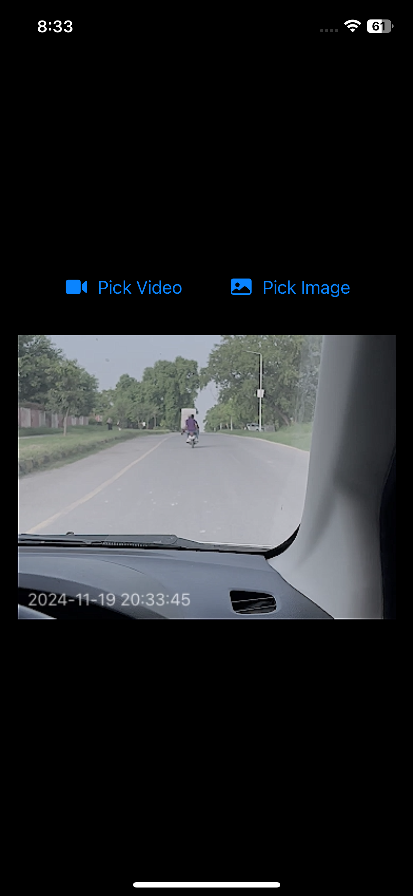
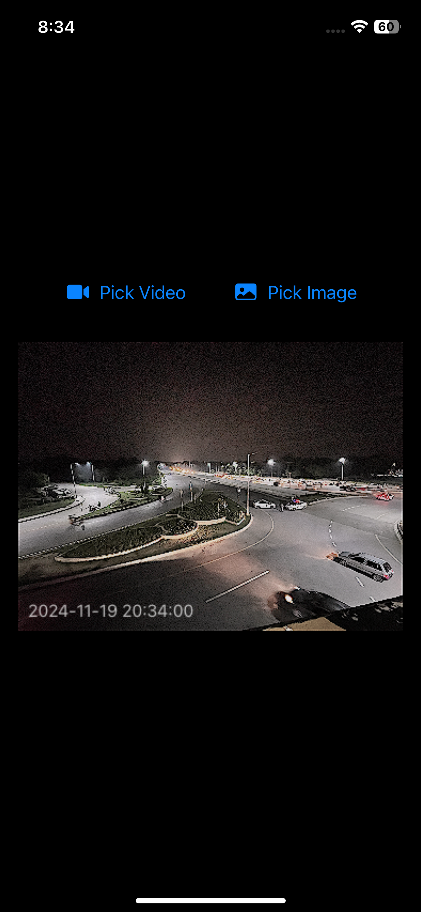
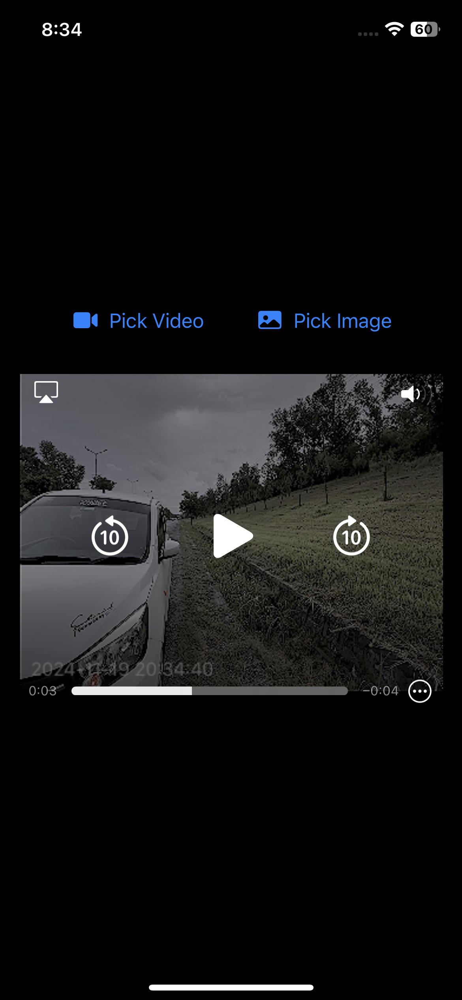

# VHS Filter App

This is a simple app that applies a 90s VHS filter to videos and images. The app is built using **SwiftUI** and follows the **MVVM (Model-View-ViewModel)** design pattern. It allows users to apply a retro VHS look, complete with static distortion and color adjustments, to any video or image they choose.

## Features
- Apply a 90s VHS filter to images and videos.
- Apply color adjustments, sharpness, and other distortions.
- Built with SwiftUI and follows the MVVM architecture pattern for better separation of concerns.

## Technologies Used
- **SwiftUI** for the user interface
- **MVVM (Model-View-ViewModel)** for clean architecture
- **Core Image** for video and image processing

## Screenshots

Here are some screenshots of the app:





## Installation

1. Clone the repository to your local machine:
   ```bash
   git clone [https://github.com/ShahzaibAli02/VHS-FILTER-IOS.git]
